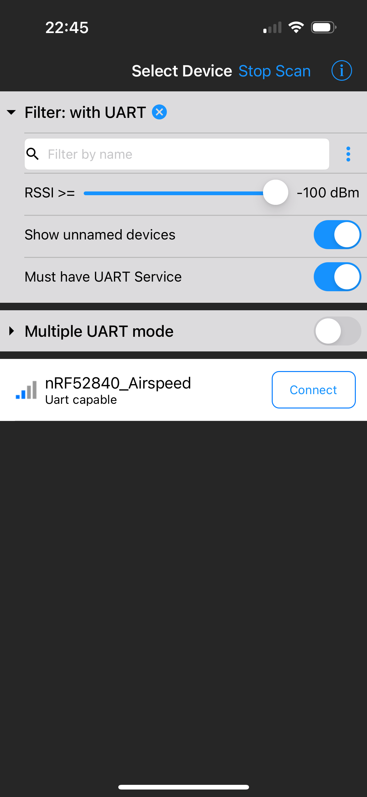

# Portable Airspeed Indicator
This project is a compact, wireless airspeed indicator built on the Nordic NRF52840 platform. It combines a pitot tube with differeential pressure senesor, and OLED display, and Bluetooth Low Energy (BLE) connectivity into a integrated system that can used for real-time feedback in various applications, for example it can be mounted on a bicycle to estimate wind resistance.

## The Phyiscs of Pitot Tube
Consider a pitot tube sits at atmospheric pressure $P_0$. Now a wind blows with speed $v$ in a direction. 
Air pushes through the small front hole of the pitot tube and come rest at the tip. It then creates a additional pressure which is just the kinetic energy per unit volume of the air $\frac{1}{2} \rho v^2$. A second opening on the side opening perpendicular to the wind feels the undisturbed atmospheric pressure $P_0$. The differential pressure sensor measures the difference between these two pressures, which is $\Delta P = P_{tip} - P_0 = \frac{1}{2} \rho v^2$. Then the speed can be calculated by the microcontroller. 

## Parts and preparation
 - Pitot tube and differential pressure sensor: [Amazon](https://www.amazon.com/Hobbypower-Digital-Airspeed-Differential-Autopilot/dp/B01J7NCML0)
 - Adafruit LED Glasses Driver: [Adafruit](https://www.adafruit.com/product/5217?srsltid=AfmBOoo-VcLDGYrkkEVdY8QZPMo0OckKZwVjwp2Jdg-jlT_cGqDGDNfU)
 - Adafruit FeatherWing OLED: [Adafruit](https://www.adafruit.com/product/4650?srsltid=AfmBOoq1GYiekpvxMkoXgxu1JwlU8Jf5BiJ4soN4oidBelVb-JkJ-nzt)
 - STEMMA QT hub: [Adafruit](https://www.adafruit.com/product/5664?srsltid=AfmBOoqX0DoMOMIQmtsybCH6lvnLGmBgTPyx-LrD6DTBydosGVaixLKW)
 - 3.7V 400mAh battery: [Adafruit](https://www.adafruit.com/product/3898?srsltid=AfmBOor0jEK0WY73R1IpE2BA-1H79V8sm2fS-L66vHPOAqdFbo5oDGbF)
 - m2x4 screw x 8
 - m2x8 screw x 4
 - m2 nut x 4
 - m3x6 screw x 1
 - m3 nut x 1
 - STEMMA QT cable 50mm x 3
 - female to female jumper wire x 1
 - 3D printed case

Solder GPIO pins of the NRF52840 board and the OLED display. However, we only need to use the reset pin, so you can just solder one pin per device.

You need to make a STEMMA QT to JST GH (used by 4525DO sensor) cable by soldering the wires together, as I didn’t find a ready-made one nor any crimping kit. Be aware of the pinout as the cable may not follow the usual color convention. The pinout is printed on the back of the PCB. Connect the reset pin on the microcontroller to the reset pin on the display using the jumper wire. The rest of the wiring is straightforward, just connect the 4 pin stemma qt hub to the OLED, the LED driver, and the differential pressure sensor.

Cut the bourbon tube of the pitot tube to a length of 6cm, and connect it to the differential pressure sensor.

Use ASA filament to print the case when possible to avoid deformation in the sun.  The case is designed to be mounted on a standard Garmin mount, so you can use a Garmin mount to attach it to your bicycle. There’s also a version with a GoPro mount so you can attach it to any other vehicle.

## Software

The software is written in C++ using the Arduino framework. Connect the microcontroller to your computer by USB.Download `airspeed.ino` and open it in the Arduino IDE. You need to install the following libraries:
 - Adafruit nRF52
 - Adafruit GFX Library
 - Adafruit SH110X
 - [Ms4525do](https://github.com/bolderflight/ms4525do)
 Make sure to select the correct board and port in the Arduino IDE, then upload the code to the NRF52840 board.

## Usage
After uploading the code, you can power the device by connecting the battery. Press the button on the side of the microcontroller to turn on the display. The display will show the current airspeed in km/h, current temerature and airdensity, and the battery voltage. Press the button again to shuffle between different display modes. There are three display modes: info, bold, and graphic.

  

You have to calibrate the device before using it. To do this, press and hold the button for 3 seconds while staying still in a indoor environment. The device will average the readings for a few seconds and set the current pressure as the baseline static pressure. This is important for accurate airspeed readings, as the static pressure can be off due to electronic noise or other factors.

It will also broadcast the airspeed data over BLE, so you can connect it to your smartphone or other BLE devices to monitor the airspeed in real-time. Download Bluefruit Connect app from the App Store or Google Play, and connect to the device. Once connected, click UART to see the airspeed data in real-time. You can also export the history data to a CSV file for further analysis in this page.

## Assembly

Once you have tested the software and everything works, you can assemble the device. The steps of assembly are important as the case is vary compact.

1. Insert the differential pressure sensor into the case and secure it on the back side of the case with the m2x4 screws. Leave the pitot tube outside the case.

2. Insert the stemma qt hub into the button side of the case, and secure it with the m2x4 screws. 

3. Install the OLED display with m2x8 screws and nuts.

4. Glue the battery to the cutout on the back side of the case, and secure the microcontroller with the m2x4 screws. Make sure the side button faces the display.

5. Wire the microcontroller to the stemma qt hub, the OLED display, and the LED driver. Don't forget the reset pin jumper wire.

6. Mount the pitot tube to the front side of the case with the m3x6 screw and nut. Make sure the pitot tube is aligned with the front opening of the case.

## What else can I do with it?

There are 2 more I2C ports on the stemma qt hub, so you can connect more sensors to it. For example, you can add a GPS module to get the ground speed, or a SD card module to log the data. You can also add a buzzer to alert you when the airspeed exceeds a certain threshold, or some more buttons for more human interface. 

